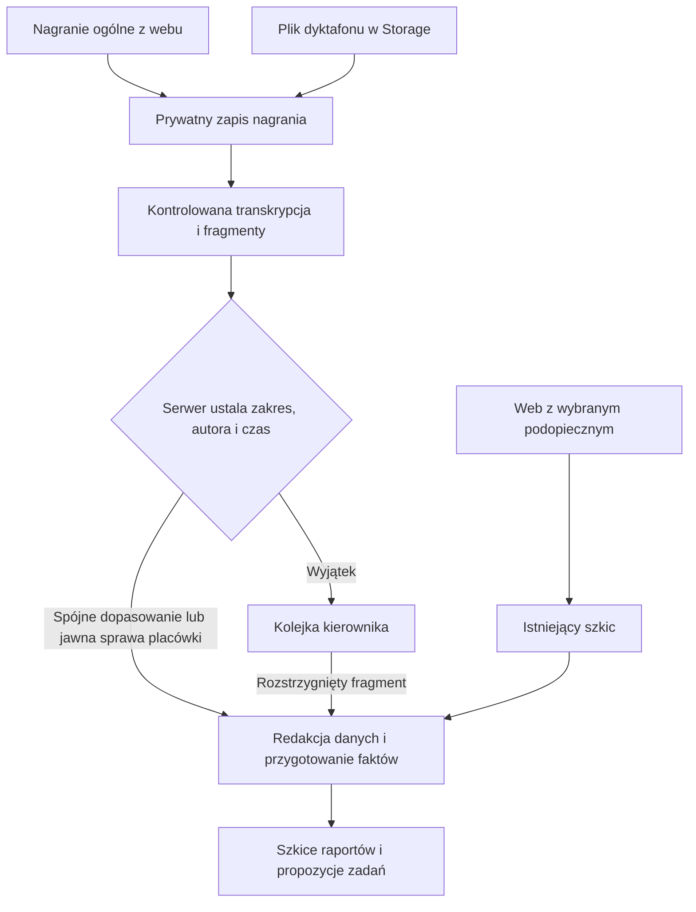

# Potok głosowy i zamknięcie zmiany

Dokument porządkuje decyzje po wdrożeniu wejść głosowych na `codex/nowe-zmiany`. Stan integracji odnosi się do [commita `40627359`](https://github.com/aiprojectmanagersznurowski-afk/silver_care/commit/40627359fbe6103c7d217020474863e081f073cb). Docelowy zakres zamknięcia zmiany opisuje [SC-NUR-20](../KANONICZNA_SPECYFIKACJA_USER_STORIES.md). Decyzje zmieniające zachowanie produktu, role lub dane przechodzą przez okno kontraktowe i odpowiedni ADR przed implementacją. Podstawą pozostają [ADR-006, ADR-007, ADR-021, ADR-022 i ADR-023](../01-ADR-decisions.md) oraz `contracts/`.

## 1. Stan integracji

| Obszar | Stan na gałęzi integracyjnej |
|---|---|
| Definicje zmian, grafik i kierownik | `shift_definitions`, `shift_roster`, `is_shift_lead` |
| Lista zadań, ręczne rozliczenie, akceptacja i wydruk | `shift_tasks`, `settle_shift_task`, `shift_plan_approvals`, `record_shift_plan_print`. Grupowanie według pokoju, podopiecznego lub pracownika. Kierownik wybiera pracownika z grafiku. Zmiana przypisania zadania do zrobienia wymaga ponownego zatwierdzenia. Wydruk pokazuje przypisanie i wersję podglądu. |
| Audyt na żądanie | Kierownik placówki w `/admin/audit` wybiera „Zmiany i nagrania” oraz zakres dat w `Europe/Warsaw`. Rejestr pokazuje m.in. przyjęcie nagrania, dopasowanie i korektę, zmianę przypisania zadania, przeniesienie, zatwierdzenie i wydruk wersji. Wyniki są stronicowane, a CSV i JSON obejmują bieżącą stronę. |
| Nagranie o podopiecznym (`APP`) | `/voice`, istniejący szkic z wybranym `resident_id`. Przetworzone notatki mogą zasilać raporty operacyjne przez redakcję. |
| Nagranie ogólne (`APP_GENERAL`) i plik z dyktafonu (`DEVICE`) | Prywatny Storage, `voice_captures`, `voice_segments`, przypisanie serwerowe i kolejka wyjątków w `/voice/assignment`. |
| Raporty operacyjne i rodzinne | Kategorie per placówka i zredagowane zdarzenia operacyjne. Zweryfikowane fakty rodzinne zasilają szkic podopiecznego za dobę kalendarzową. Publikacja ma własną akcję. |
| Propozycje z nagrania | Jawna dyspozycja na kolejną zmianę daje `PROPOSED` w `shift_tasks`, z cytatem i identyfikatorem źródła. |
| Następny etap | Głosowa podpowiedź rozliczenia, zamknięcie zmiany, odbiór przekazania, aneks, historia w ramach zmiany i osobny obieg incydentu. |

Gałąź integracyjna to `codex/nowe-zmiany`. Promocja do `staging` przebiega osobno po powrocie Michała i review. [PR #313](https://github.com/aiprojectmanagersznurowski-afk/silver_care/pull/313)

## 2. Rozstrzygnięcia dotyczące nagrań

### Kanały, zakres i model danych

Placówka używa webu, urządzeń lub obu kanałów w zależności od organizacji pracy. Trybu używanego na pilotażu pilnuje procedura placówki. Osobną konfigurację wyłączania konkretnego kanału rozważymy po wykazaniu potrzeby.

| Źródło | Zakres początkowy | Autor | Powiązanie ze źródłem |
|---|---|---|---|
| `APP` | Podopieczny wybrany przed nagraniem | Sesja webowa | `voice_draft_notes` |
| `APP_GENERAL` | Zakres nieustalony | Sesja webowa | `voice_captures` → `voice_segments` |
| `DEVICE` | Zakres nieustalony | Deklaracja w pierwszym nagraniu sesji lub ręczna korekta | `voice_captures` → `voice_segments` |

`voice_draft_notes` zachowuje wymagane `resident_id` i `nurse_id` dla trybu `APP`. Nowe źródła mają oddzielny model przyjęcia i podziału, a fakty zachowują relację z segmentem albo istniejącym szkicem. Opis `COMMIT` w `DEVICE_INGEST_PROTOCOL` nadal wskazuje `voice_draft_notes`. Decyzja dla integracji sprzętowej to aktualizacja tego zapisu w oknie kontraktowym, tak aby kierował do `voice_captures` i kolejkowania segmentów po transkrypcji. [#307](https://github.com/aiprojectmanagersznurowski-afk/silver_care/issues/307)

### Przypisanie i materiał mieszany

Serwer dopasowuje nazwisko, pokój lub łóżko do rejestru właściwej placówki. Jedno spójne dopasowanie wystarcza do przypisania **szkicu**. Sprzeczne wskazania, niepewny czas, nieustalony autor, kilka osób w jednym fragmencie albo brak dopasowania trafiają do kolejki uprawnionego kierownika. Wyraźna sprawa placówki otrzymuje zakres `FACILITY`. W webie autor może z góry wybrać `APP`, a w trybie ogólnym obowiązuje wspólna ścieżka automatycznego przypisania i wyjątków.

Personelowi zalecamy jedną osobę lub sprawę na wypowiedź. Plik może zawierać wiele wypowiedzi, a fragment ma najwyżej jednego podopiecznego. Mieszany fragment wymaga wyodrębnienia dokładnych pododcinków źródłowych przez uprawnioną osobę albo ponownego nagrania. Jeśli żadna ścieżka nie daje jednoznacznego wyniku, kierownik oznacza fragment jako nie do przypisania. Ręczny podział jest rozszerzeniem kolejki. Dziś kierownik ma do dyspozycji jej dotychczasowe decyzje.


```mermaid
flowchart TD
    app["Web z wybranym podopiecznym"] --> draft["Istniejący szkic"]
    general["Nagranie ogólne z webu"] --> capture["Prywatny zapis nagrania"]
    device["Plik dyktafonu w Storage"] --> capture
    capture --> segment["Kontrolowana transkrypcja i fragmenty"]
    segment --> match{"Serwer ustala zakres, autora i czas"}
    match -->|"Spójne dopasowanie lub jawna sprawa placówki"| redact["Redakcja danych i przygotowanie faktów"]
    match -->|"Wyjątek"| review["Kolejka kierownika"]
    review -->|"Rozstrzygnięty fragment"| redact
    draft --> redact
    redact --> output["Szkice raportów i propozycje zadań"]
```

### Wspólny dyktafon, czas i audyt

Pracownik przedstawia się na początku sesji urządzenia. Jedno dopasowanie do personelu placówki zapisuje deklarowanego autora. Przydział sprzętu służy ewidencji wydania. Niepewna deklaracja trafia do kolejki. Ręczna korekta dotyczy wskazanego fragmentu i ma własny ślad. Przy przejęciu dyktafonu bez nowej sesji i przedstawienia się audyt zachowuje deklarację bieżącej sesji. Źródło bez ustalonego autora pozostaje w stanie `UNKNOWN`. Wartość „zespół” służy przypisaniu zadania wspólnego. Do autorstwa używamy rozpoznanej osoby lub jawnego braku.

- `recorded_at`, `received_at` i czas opisywanego zdarzenia mają różne znaczenie. Czas zdarzenia wskazany przez personel zapisujemy odrębnie i może pozostać nieustalony.
- Zmiana wynika z wiarygodnego czasu nagrania w `Europe/Warsaw` z uwzględnieniem zmiany nocnej. `SYNCED` korzysta z czasu urządzenia, a `RELATIVE` z chwili przyjęcia INIT pomniejszonej o wiek nagrania. Dla `UNKNOWN` docelowo kierownik wskazuje zmianę i podstawę korekty, zachowując oryginalny czas w metadanych.
- Audyt zapisuje identyfikatory źródła i aktora, metodę, czas oraz zmianę przypisania. Treść audio, transkrypt i dane medyczne pozostają w przeznaczonych do tego zasobach z odrębnymi uprawnieniami i retencją.
- Odkładanie urządzeń 20 minut przed końcem zmiany i rozliczenie w ciągu 30 minut po końcu to punkt wyjścia pilotażu. Interfejs pokazuje postęp synchronizacji oraz możliwość zamknięcia częściowego. Placówka ustala organizację pracy.

## 3. Zamknięcie zmiany, zadania i wydruk

Widok „Zamknięcie zmiany” prowadzi kierownika zamykanej zmiany lub kierownika placówki od wyjątków przypisań przez fakty i rozliczenia do szkicu przekazania. Nagłówek podaje zmianę, datę, odpowiedzialną osobę, kompletność materiału i wersję przekazania. Szczegóły wiążą decyzję z identyfikatorem źródła. Odczyt źródła podlega jego własnym uprawnieniom.

1. **Zadania.** Korzystamy z `shift_tasks` i `assignee_user_id`. Pracownik pochodzi z grafiku danej placówki i zmiany. Puste przypisanie oznacza zadanie wspólne. Obok pokoju i podopiecznego dochodzi widok według pracownika. Zespół widzi tę samą listę na uwierzytelnionym urządzeniu placówki w dyżurce. Wydruk A4 pozostaje kanałem dla zespołów pracujących z papierem.
2. **Propozycje i rozliczenie.** Nowe zadanie z wypowiedzi ma status `PROPOSED`. Głosowe sprawozdanie o wykonaniu daje podpowiedź do istniejącego zadania z jednoznacznym dopasowaniem i cytatem. Negację, odmowę, warunek i brak pewności obsługujemy odrębnie. Uprawniony kierownik podejmuje decyzję przez istniejący mechanizm rozliczenia. Zgłoszenie usterki jest faktem operacyjnym. Wyraźna dyspozycja działania może dodatkowo dać propozycję zadania placówki.
3. **Przekazanie.** Szkic korzysta z dopuszczonych faktów tej zmiany, stanu zadań, otwartych spraw i opcjonalnej notatki kierownika. Notatka oznaczona jako przekazanie zasila obieg wewnętrzny. Kierownik zatwierdza treść, a kierownik przyjmującej zmiany lub uprawniony zastępca potwierdza odbiór konkretnej wersji z osobnym czasem i aktorem.
4. **Plan i wydruk.** Kierownik zatwierdza wersję planu następnej zmiany. Wydruk pokazuje tę samą wersję co zdarzenie audytowe. Powtórzenie niezmienionego wydruku zapisuje kolejny ślad dla tej samej wersji. Zmiana planu, także przypisania, wymaga następnej akceptacji. Wydruk pokazuje faktyczne przypisanie i zawiera pola dopuszczone przez kontrakt.
5. **Braki i spóźnione dane.** `COMPLETE` wymaga dowodu, że oczekiwane nagrania z danego zakresu dotarły. Sam upływ czasu nie stanowi dowodu. `PARTIAL` oznacza znany brak, a `UNKNOWN` brak dowodu kompletności. W dwóch ostatnich stanach kierownik może zatwierdzić przekazanie jako częściowe z jawnym powodem. Spóźniony materiał tworzy propozycję aneksu powiązaną z wcześniejszą wersją. Zatwierdzony aneks ma własny audyt i własny odbiór.

## 4. Raporty i formalny incydent

| Wynik | Źródło i obieg |
|---|---|
| Przekazanie wewnętrzne | Dopuszczone fakty zakończonej zmiany, rozliczenie zadań i otwarte sprawy. Osobna akceptacja, odbiór i aneks. Potrzebne dane medyczne pozostają w ograniczonej części z `daily_logs`, bez przekazywania ich do modelu. |
| Raport operacyjny | Zredagowane zdarzenia kategorii w jej oknie. Odbiorcy wynikają z konfiguracji placówki. Brak danych ma jawny komunikat. |
| Formalny incydent | Oddzielna wewnętrzna sprawa z powiązaniem źródła, osobą odpowiedzialną, działaniami, statusem i decyzją kierownika placówki lub wyznaczonej roli. Nagranie może podpowiedzieć szkic zgłoszenia. Pilne działania biegną dotychczasową procedurą placówki. Pierwsze wydanie obejmuje obsługę i historię w systemie. Eksport jest odrębnym etapem po uzgodnieniu formatu i uprawnień. |
| Raport rodzinny | Tylko dopuszczone fakty dotyczące jednego podopiecznego. Osobne zatwierdzenie i publikacja przez uprawnioną osobę. Po publikacji spóźnione fakty mogą wejść do jawnej korekty zatwierdzanej przez człowieka. |

Szczegóły leków i inne informacje zdrowotne zachowują kontrolę dostępu z `daily_logs`. Potwierdzenie zgłoszenia dotyczącego leków należy do osoby z uprawnieniami określonymi przez procedurę placówki i obowiązujący kontrakt. Sposób postępowania z danymi medycznymi, zakres odpowiedzialności oraz podstawa prawna podlegają zatwierdzeniu przed pilotażem. [#306](https://github.com/aiprojectmanagersznurowski-afk/silver_care/issues/306)

### Doba rodzinna i obchód

Obecna doba szkicu biegnie od północy do północy w `Europe/Warsaw`. Docelowo placówka może oznaczyć jedną zmianę jako zamykającą dobę raportu. Przy dwóch i trzech zmianach okno wyznaczają kolejne lokalne końce tej zmiany. Dla grafiku 07:00–19:00 i 19:00–07:00 po wskazaniu zmiany dziennej doba kończy się o 19:00. Placówki bez takiej konfiguracji zachowują północ. Nowa granica działa dla przyszłych okresów, uwzględnia zmianę czasu i zachowuje historię szkiców. Przejście wymaga osobnego kontraktu i testów. Kierownik zmiany zamykającej dobę albo osoba uprawniona do zastępstwa publikuje raport po osobnym zatwierdzeniu. Szkic zapisuje się względem konkretnej wersji, a konflikt wymaga ponownego odczytu. Opublikowaną treść uzupełnia się przez jawną korektę.

Osoba, która wykonała obchód, rejestruje jego wykonanie. Kierownik zmiany weryfikuje zapis przed publikacją. Komunikat o obchodzie może powstać po potwierdzeniu wykonania. Przy braku dowodu szkic albo widok personelu mówi wprost o braku danych. Powiadomienie dla bliskich wynika z publikacji zatwierdzonego raportu.

## 5. Instrukcja wdrożenia i weryfikacji

- **Planista.** Wybieramy jeden planista HTTPS na środowisko, który trzyma `CRON_SECRET` w swoim magazynie sekretów i wywołuje chronionego workera. W pilotażu zacznij od wywołania co minutę. Dopasuj częstotliwość do czasu obsługi i wieku najstarszego oczekującego nagrania. Sprawdź ponowienia, idempotencję i retencję na docelowym środowisku. Przypomnienia organizacyjne w pierwszym etapie trafiają do widoku personelu.
- **Prywatność.** Audio i transkrypt pozostają w prywatnym Storage i zatwierdzonej usłudze transkrypcji oraz redakcji. Model raportowy w EOG otrzymuje materiał po redakcji. Tryb demo dotyczy danych syntetycznych w granicach kontraktu. Retencję odczytujemy z `VOICE_RETENTION` i ustawień placówki. Cykl życia kont personelu zachowuje powiązania audytowe zgodnie z kontraktem. Zakończenie pracy w placówce wygasza dostęp. Formalizacja pilotażu, zatwierdzenie warunków przetwarzania i procedura placówki poprzedzają użycie rzeczywistych danych. [#306](https://github.com/aiprojectmanagersznurowski-afk/silver_care/issues/306)
- **Urządzenia.** Dyktafon zachowuje plik do potwierdzenia trwałego przyjęcia. Przy braku Wi-Fi wykorzystywana jest kontrolowana kolejka urządzenia. Pilotaż zaczyna się bez dodatkowego lokalnego bufora. Instrukcja personelu obejmuje nagrywanie w otoczeniu innych osób i zasady używania sprzętu placówki. [#307](https://github.com/aiprojectmanagersznurowski-afk/silver_care/issues/307), [#309](https://github.com/aiprojectmanagersznurowski-afk/silver_care/issues/309)
- **Test odbiorowy.** Na danych syntetycznych przejdź oba wejścia webowe, zrzut z urządzenia, powtórzenie wysyłki, brak autora, niepewny czas, kilka osób w fragmencie, zamknięcie częściowe i aneks. Sprawdź RLS między placówkami, dostęp rodziny, wydruk dokładnie zatwierdzonej wersji i ślad w audycie bez treści notatek.
- **Pomiar pilotażu.** Przed startem zbierz próbę porównywalnych zmian dziennych i nocnych. Mierz medianę i 90. percentyl czasu pracy kierownika od rozpoczęcia rozliczenia do zatwierdzenia, czas personelu poświęcony na dokumentację, czas do odbioru przekazania, odsetek fragmentów przypisanych bez korekty i odsetek zmian częściowych. Rozdziel opóźnienie synchronizacji od pracy człowieka. Agreguj wyniki bez treści nagrań i danych podopiecznych. [#309](https://github.com/aiprojectmanagersznurowski-afk/silver_care/issues/309)

## 6. Instrukcja integracji

### 6.1. Uruchomienie lokalne i próba webowa

1. Użyj `origin/codex/nowe-zmiany` z commitem `40627359` lub nowszym. Przy lokalnych zmianach użyj osobnego worktree. Potrzebne są Node.js w wersji używanej przez CI, pnpm i lokalny projekt Supabase. Sprawdź migracje poleceniem `supabase migration list --local`. W lokalnym projekcie z uzgodnioną historią migracji `supabase migration up --local` aplikuje oczekujące migracje z gałęzi.
2. Przekaż **serwerowi Next.js** lokalne wartości według [`.env.example`](../../.env.example). Możesz wczytać plik w `apps/web/.env.local` lub wyeksportować wartości do procesu. Ustaw lokalny adres Supabase, publiczny klucz dla webu i serwerowy `SUPABASE_SERVICE_ROLE_KEY`. Klucz usługi, tokeny i `CRON_SECRET` pozostają po stronie serwera. Uruchom aplikację poleceniami `pnpm install --frozen-lockfile` i `PORT=3001 pnpm dev`.
3. Otwórz `http://localhost:3001/voice` w przeglądarce z dostępem do mikrofonu. Użyj konta `nurse` albo `org_admin` z przypisaną placówką i włączonym `module_voice_and_reports`. Nagranie ogólne wymaga sesji `aal2`. Jeśli lokalny projekt ma wyłączone TOTP, włącz rejestrację i weryfikację TOTP w jego konfiguracji testowej, a następnie potwierdź drugi składnik w webie.
4. Sprawdź dwa scenariusze na danych syntetycznych. Tryb z podopiecznym korzysta z istniejącej ścieżki `POST /api/voice/transcribe`, która wymaga `GROQ_API_KEY` dla transkrypcji. „Nagranie ogólne” korzysta z `POST /api/voice/captures`. Do próby samego przyjęcia wystarczą Supabase i sesja personelu. Odczyt wyniku wymaga prywatnego STT i redakcji oraz kolejnych wywołań workera.

#### Żądanie nagrania ogólnego

`POST /api/voice/captures` przyjmuje `multipart/form-data`. Pole `file` to plik audio do 4 MiB, a jego typ musi odpowiadać zawartości. Obsługiwane są WebM, Ogg, MP4/M4A i WAV. `client_uuid` jest stabilnym UUID nadanym przez klienta. `author_id` musi pasować do użytkownika z sesji i jest używane do kontroli ponowienia z kolejki offline. `recorded_at` to czas zapisany przy nagraniu, najlepiej w ISO 8601 ze strefą. Przy niepoprawnym lub zbyt dalekim przyszłym czasie zapis otrzymuje `clock_state = UNKNOWN`.

| Wynik | Znaczenie |
|---|---|
| `202` i `{"success":true,"captureId":"<uuid>"}` | Plik i rekord w kolejce zostały przyjęte. Worker przetwarza je w tle. |
| Ponowienie tego samego `client_uuid` i tych samych bajtów przez tego samego autora | Ten sam `captureId`. Zachowaj pierwotny UUID, autora i czas. |
| `409` | Ten identyfikator lub obiekt Storage jest już związany z innymi bajtami. Sprawdź, który plik ma być źródłem. |
| `401` / `403` | Sprawdź sesję, drugi składnik, autora, rolę i moduł placówki. |
| `400` / `413` | Sprawdź UUID, format, obecność pliku i rozmiar. |
| `503` albo zerwane połączenie | Ponów z tym samym UUID i plikiem. Jeśli poprzednia próba zapisała tylko plik, kolejna próba może dokończyć rejestrację po sprawdzeniu skrótu. |

### 6.2. Prywatne STT, redakcja i worker

| Ustawienie | Umowa wejścia i wyjścia |
|---|---|
| `VOICE_PRIVATE_STT_URL` | HTTPS bez przekierowań. `POST` przesyła bajty pliku i jego `Content-Type`. Zwróć JSON `{"segments":[{"start_ms":0,"end_ms":1800,"text":"Przykładowa wypowiedź."}]}`. Czasy są w milisekundach od początku pliku. Segmenty mają dodatnią długość, idą kolejno, nie nakładają się i mają po najwyżej 12 000 znaków tekstu. Limit to 250 segmentów na odpowiedź. |
| `VOICE_PRIVATE_REDACT_URL` | Inna ścieżka HTTPS w tym samym originie co STT, bez przekierowań. `POST` przyjmuje JSON `{"text":"…"}` i zwraca `{"redacted_transcript":"…"}` po usunięciu danych identyfikujących i medycznych. Pusty ciąg oznacza, że po redakcji nie zostało nic do klasyfikacji. Awarię usługi sygnalizuj błędem HTTP. |
| `VOICE_PRIVATE_STT_TOKEN` | Wspólny server-side token Bearer do prywatnego STT i redakcji. Przy lokalnym TLS dodaj certyfikat wystawcy do zaufanych certyfikatów procesu Node, np. przez `NODE_EXTRA_CA_CERTS`. |
| `EU_LLM_API_KEY`, `EU_LLM_ENDPOINT` i `EU_LLM_MODEL` | Konfiguracja dozwolonego modelu w EOG. Do tego etapu trafia materiał po redakcji. |
| `CRON_SECRET` | Bearer dla `GET /api/cron/process-voice-captures`. Produkcyjnie cyklicznie wywołuje go planista HTTPS. W lokalnej próbie możesz uruchomić kilka kolejnych przebiegów ręcznie. |

Z terminala uruchom worker i sprawdź wynik wraz z kodem HTTP. Polecenie korzysta z istniejącej zmiennej środowiskowej.

```bash
curl -sS -i -H "Authorization: Bearer ${CRON_SECRET:?Ustaw lokalny CRON_SECRET}" \
  http://localhost:3001/api/cron/process-voice-captures
```

Odpowiedź ma pola `capture` (transkrypcja i segmentacja), `projection` (fakty z fragmentu), `selectedWeb` (projekcja przetworzonej notatki `APP`), `operational` (raport według harmonogramu) i `retention` (wygasłe źródła). Są to niezależne zadania, każde może zwrócić `processed`, `idle` albo `failed`. `idle` oznacza brak zadania do podjęcia w tym przebiegu, np. przed następnym etapem lub w czasie oczekiwania na retry. Błąd jednego zadania daje `503` z wynikami pozostałych. `401` oznacza brak lub błędny token workera.

Dla znanego błędu przejściowego etap przyjętego audio wraca do przetworzenia do wyczerpania limitu pięciu prób. Nieprawidłowa integralność, pusty plik lub przekroczenie limitu pliku workera 25 MiB ustawia `FAILED`. Sprawdź stan po `captureId` w `voice_captures` oraz metadane zdarzenia `VOICE_CAPTURE_RECEIVED`. Po `SEGMENTED` sprawdź wynik przypisania fragmentu. Do diagnostyki wystarczają identyfikatory, stany i kody błędów.

### 6.3. Wejście pliku ze stacji

Integrację prowadź na granicy **prywatny Supabase Storage plus rejestracja pliku po stronie serwera**. Stacja lub jej zaufany serwis integracyjny dostarcza plik, a backend Silver Care wykonuje rejestrację z uprawnieniami `service_role`. W docelowym protokole firmware korzysta z tokenu urządzenia i podpisanego adresu zapisu. Klucz usługi pozostaje w backendzie.

1. Zweryfikuj urządzenie w rejestrze placówki. Zapamiętaj `device_id`, UUID nagrania `client_capture_id`, UUID sesji oraz kolejność w sesji. Zapisz plik w prywatnym buckecie `voice-recordings` pod dokładnym kluczem `<organization_id>/device/<device_id>/<client_capture_id>`. Klucz nie zawiera nazwy bucketu i zachowuje postać także przy ponowieniu.
2. Wylicz SHA-256 z bajtów oryginalnego pliku i porównaj go z zawartością zapisaną w Storage przed końcowym potwierdzeniem dla firmware’u. Podpisany `PUT` potwierdza etap wysyłki do Storage. Docelowy `COMMIT` potwierdza integralność oraz trwałą rejestrację i dopiero jego wynik `ACCEPTED` lub prawidłowy `DUPLICATE` pozwala urządzeniu skasować kopię.
3. Wywołaj RPC `register_stored_device_capture` z serwera. Poniższe nazwy argumentów odpowiadają implementacji na gałęzi integracyjnej.

| Argument RPC | Wartość |
|---|---|
| `p_device_id` | UUID z rejestru urządzeń. Placówka wynika z tego wpisu. |
| `p_source_key` | UUID `client_capture_id`. |
| `p_session_id`, `p_session_seq` | UUID sesji i liczba całkowita od 1. Pierwsze nagranie zawiera przedstawienie się pracownika. |
| `p_storage_path` | Klucz obiektu w prywatnym buckecie. |
| `p_sha256` | 64 znaki szesnastkowe reprezentujące skrót bajtów, z małymi literami. |
| `p_recorded_at`, `p_clock_state` | Czas ISO 8601 i `SYNCED`, `RELATIVE` albo `UNKNOWN`. Dla `RELATIVE` serwer zapisuje czas z pierwszego INIT pomniejszony o `age_ms`. Użyj tej samej wyliczonej wartości przy następnym żądaniu. Dla `UNKNOWN` zachowaj skończony czas przekazany przez urządzenie jako materiał audytowy i sprawdź wyjątek w kolejce. |

Przykładowe wywołanie z serwera posługuje się metadanymi sprawdzonego, zapisanego pliku.

```js
const { data: captureId, error } = await supabaseAdmin.rpc('register_stored_device_capture', {
  p_device_id: deviceId,
  p_source_key: clientCaptureId,
  p_session_id: sessionId,
  p_session_seq: sessionSequence,
  p_storage_path: storagePath,
  p_sha256: verifiedSha256,
  p_recorded_at: recordedAt,
  p_clock_state: clockState,
})
if (error) {
  throw new Error('VOICE_STORAGE_REGISTRATION_FAILED')
}
```

Udane RPC zwraca UUID rekordu `voice_captures`. Sprawdza obecność obiektu i metadane, a worker ponownie weryfikuje zapisane bajty. Ponowienie z tym samym urządzeniem, UUID nagrania i tym samym skrótem, sesją, kolejnością oraz czasem zwraca to samo ID, o ile obiekt nadal istnieje. `CONFLICTING_VOICE_CAPTURE_RECEIPT` lub powtórzenie pozycji sesji przez inny plik wymaga sprawdzenia po stronie stacji. Przy `VOICE_STORAGE_OBJECT_REQUIRED` sprawdź zakończenie wysyłki, a przy `VOICE_DEVICE_UNAVAILABLE` rejestr, unieważnienie urządzenia i moduł placówki.

Opis `COMMIT` w kontrakcie firmware’u wciąż wskazuje `voice_draft_notes`. Decyzja dla integracji to zapis `voice_captures` i późniejsza segmentacja, zgodna z działającą granicą Storage i RPC. Aktualizacja kontraktu firmware’u oraz obsługa tras `/api/voice/device` i `/api/voice/device/commit` mają zakres w [#307](https://github.com/aiprojectmanagersznurowski-afk/silver_care/issues/307). Do próby aplikacji można dostarczyć gotowy plik przez Storage i RPC.

### 6.4. Oczekiwany wynik próby

| Próbka | Gdzie potwierdzić wynik |
|---|---|
| Znany podopieczny z syntetycznego rejestru, np. „Maria Testowa zjadła śniadanie”, jeśli taki wpis przygotowano | Po przetworzeniu i klasyfikacji sprawdź fakty w `/staff/reports/voice-facts`. Decyzja personelu o fakcie zasila szkic rodzinny. Publikacja następuje w osobnej akcji. |
| Fragment bez wskazania osoby ani sprawy placówki | `/voice/assignment` pokazuje wyjątek uprawnionemu kierownikowi. Gdy czas jest niepewny i nie ustalono zmiany, sprawdź go na koncie kierownika placówki. |
| „Sprawa placówki. Na następną zmianę: przygotować świeże kubki.” | Przy skonfigurowanym grafiku i module zadań sprawdź propozycję `PROPOSED` na kolejnej zmianie. |
| Zdarzenie zakwalifikowane do aktywnej kategorii operacyjnej | Sprawdź `/staff/reports/operational` po zakwalifikowaniu zdarzenia i po zamknięciu okresu wynikającego z harmonogramu kategorii. |
| Drugie nagranie z dyktafonu przed przedstawieniem się, potem pierwsze nagranie tej sesji | Pierwszy wynik ma brak autora. Po przetworzeniu przedstawienia system może uzupełnić deklarowane autorstwo w istniejących wyjątkach. Ręczna korekta zachowuje pierwszeństwo. |

Dowód próby zapisz wiążąc kod HTTP, UUID nagrania, wynik workera i obserwację z panelu. Surowe treści i klucze pozostają w środowisku testowym.

## 7. Kolejność GitHub Issues

Stan z 22 listopada 2026. Numery wskazują istniejące otwarte issues. Pozycje „nowe issue” są propozycjami do zapisania na GitHubie przed rozpoczęciem danej implementacji.

| Kolejność | Issue i zależności | Oczekiwany rezultat |
|---|---|---|
| 0 · równolegle | [#316](https://github.com/aiprojectmanagersznurowski-afk/silver_care/issues/316), [#304](https://github.com/aiprojectmanagersznurowski-afk/silver_care/issues/304), [#314](https://github.com/aiprojectmanagersznurowski-afk/silver_care/issues/314), [#315](https://github.com/aiprojectmanagersznurowski-afk/silver_care/issues/315) | Zestaw dowody z `codex/nowe-zmiany` z kryteriami otwartych issues. Wykonaj lokalną próbę obu wejść webowych i zapisz braki jako zadania do uzupełnienia. |
| 1 · kontrakt | `SC-NUR-20` i `NUR-SHIFT-CLOSURE` | Kontrakt obejmuje role, kompletność, wersję, odbiór, aneks, przypisanie według grafiku i audyt okresowy. Obieg incydentów ma własny zakres. |
| 2 · plan pracy | [#259](https://github.com/aiprojectmanagersznurowski-afk/silver_care/issues/259) i [#305](https://github.com/aiprojectmanagersznurowski-afk/silver_care/issues/305) po odpowiednim fragmencie kontraktu | Przypisanie z grafiku, wspólne zadania, widok według pracownika, minimalny wydruk i zgodność wersji z audytem. Zabezpieczenie wersji wydruku można zacząć na podstawie obecnego `NUR-SHIFT-PLAN-PRINT`. |
| 3a · rozliczenie głosowe | Nowe issue „Głosowe podpowiedzi rozliczenia” po kroku 1, powiązane z [#259](https://github.com/aiprojectmanagersznurowski-afk/silver_care/issues/259) | Dopasuj wypowiedź do istniejącego zadania, rozróżnij negację i odmowę, przetestuj decyzję przez `settle_shift_task`. |
| 3b · wyjątki źródłowe | Nowe issue „Korekta czasu i podział mieszanego fragmentu”, powiązane z [#316](https://github.com/aiprojectmanagersznurowski-afk/silver_care/issues/316) | Rozstrzygnij czas i mieszany materiał w kolejce. Zachowaj oryginalne metadane, precyzyjne granice pododcinków oraz historię korekty. |
| 4 · przekazanie | Nowe issue „Zamknięcie zmiany, odbiór i aneks” po kroku 1, z integracją kroków 2 i 3 | Wersjonowane zatwierdzenie, jawny stan niekompletny, odbiór i aneks. Jeden widok i test przebiegu dwóch zmian. |
| 5 · raporty szczególne | Dwa nowe issues „Wewnętrzny obieg incydentów” i „Granica doby i korekty raportu rodzinnego” | Osobny obieg incydentu oraz jawne zasady doby, spóźnionych faktów, uprawnień i publikacji raportu rodzinnego. Prace mogą biec równolegle z domykaniem widoku po uzgodnieniu odpowiednich kontraktów. |
| 6 · pilotaż i promocja | [#306](https://github.com/aiprojectmanagersznurowski-afk/silver_care/issues/306), [#309](https://github.com/aiprojectmanagersznurowski-afk/silver_care/issues/309), sprzętowo [#307](https://github.com/aiprojectmanagersznurowski-afk/silver_care/issues/307) | Formalizacja pilotażu, prywatne STT i redakcja, harmonogram, dowód retencji i gotowość placówki. Akceptacja przez drugą osobę przed promocją. |

Historia raportów, odczyty audytowe i analityka realizacji mają własne zakresy. Zamknięcie zmiany korzysta z istniejącego `audit_logs` dla decyzji i z `shift_tasks` jako trwałej listy. [#258](https://github.com/aiprojectmanagersznurowski-afk/silver_care/issues/258), [#310](https://github.com/aiprojectmanagersznurowski-afk/silver_care/issues/310), [#311](https://github.com/aiprojectmanagersznurowski-afk/silver_care/issues/311)

Każde issue wskazuje kanoniczne story, REQ, zależności i dowody akceptacji. Prace przechodzą przez PLAN → CONTRACT, gdy potrzeba → RED → GREEN → VERIFY → REVIEW. Komentarze, przypisania i statusy review prowadź w GitHub Issues oraz GitHub Projects „Silver Care”. Do przekazania kompletnego zakresu służy `node tools/sc-pr-handoff.mjs <NUMER_ISSUE> --pr <NUMER_PR>`. W trakcie integracji używaj `Refs #…`, a `Closes #…` wiąż z PR-em, który dostarcza całe issue.
